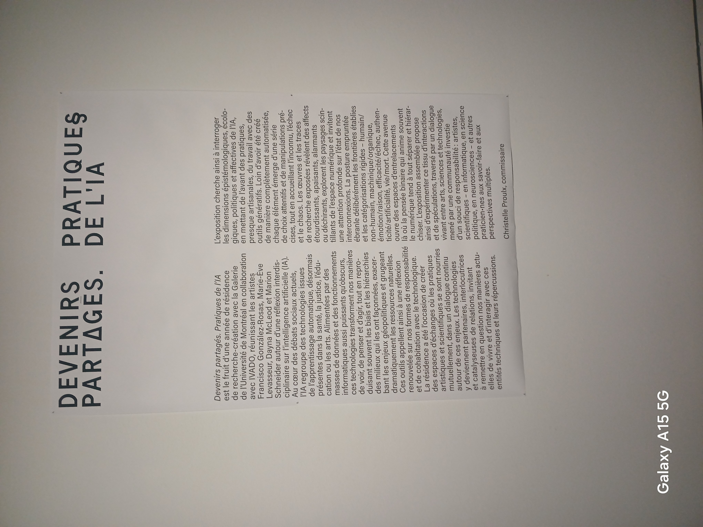
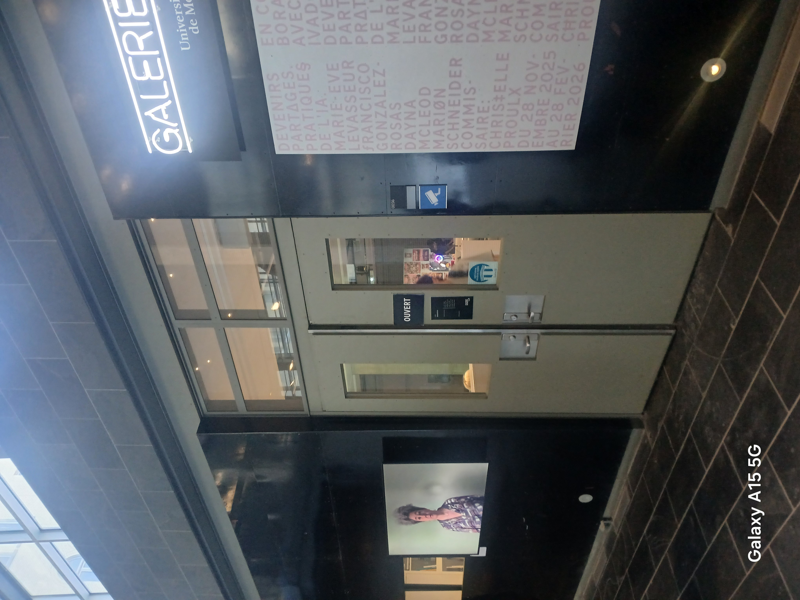

# Fiche d'exposition pour l'exposition de l'Université de Montréal
## Nom de l'exposition
Le nom de l'exposition est «Devenir partagé. Pratique de l'IA». Voici une affiche de l'exposition qui présente globalement l'exposition.

## Lieu de mise en exposition
Cette exposition a été présenter à la galerie de l'Université de Montréal. L'adresse de ce batiment est le 2940 chemin de la Côte-Sainte-Catherine. Voici l'entrée de l'exposition.

## Type d'exposition
Cette exposition est temporaire et intérieur. Cette exposition est disponible du 28 novembre 2025 au 28 février. Comme je l'ai dis précédement l'exposition à l'intérieur de la galerie de l'Université de Montréal.

## Date de visite
Je suis allé à l'exposition le 29 janvier 2026.

## Nom de l'oeuvre
Le nom de l'oeuvre que j'ai choisis est «Sloppy».

