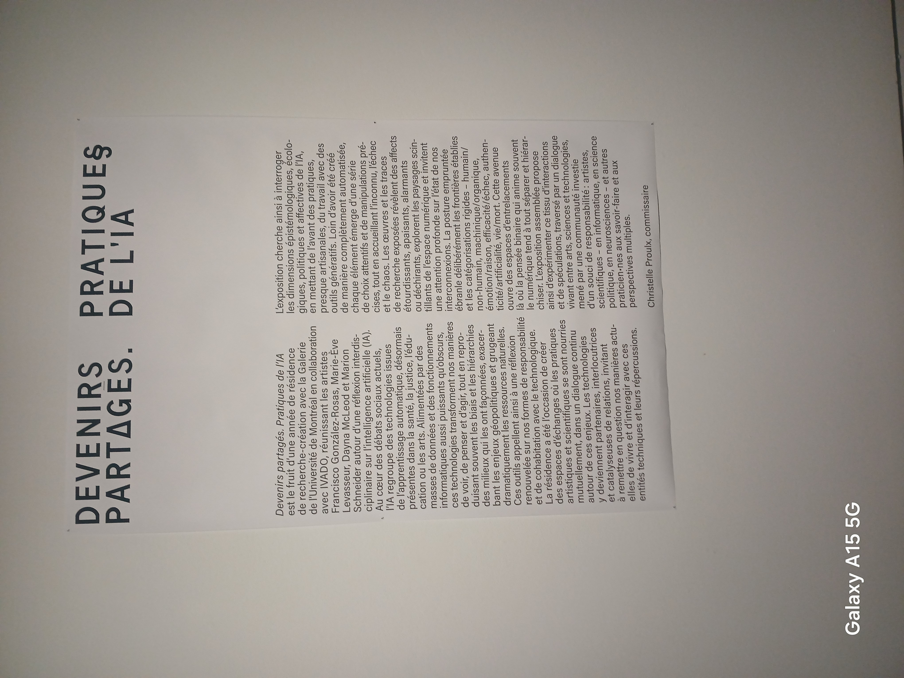
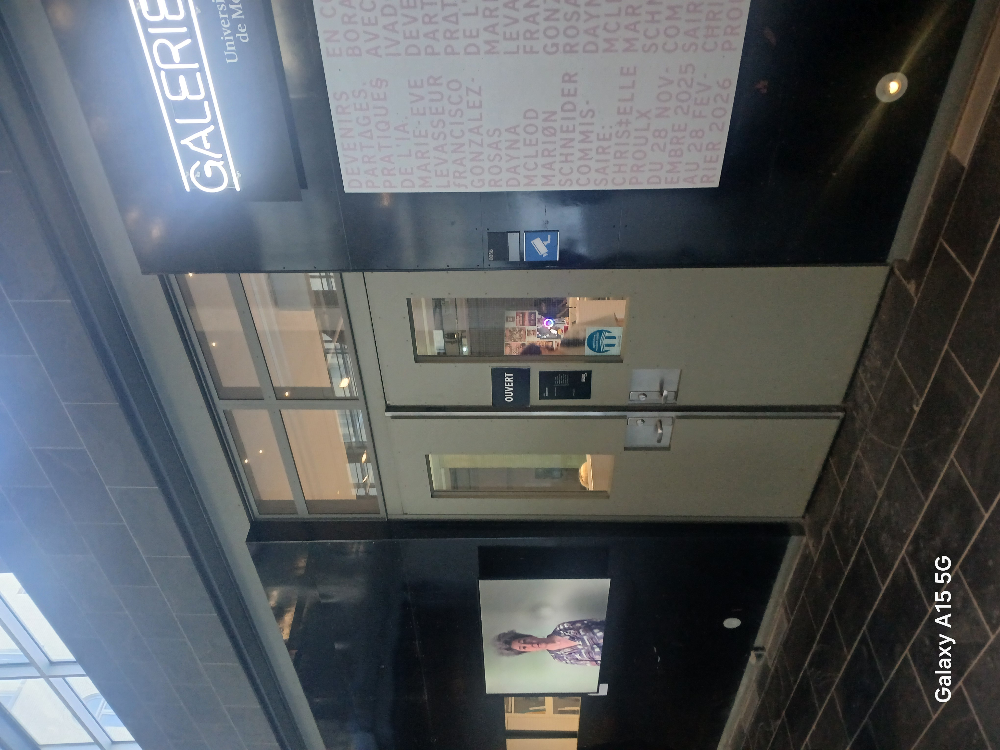
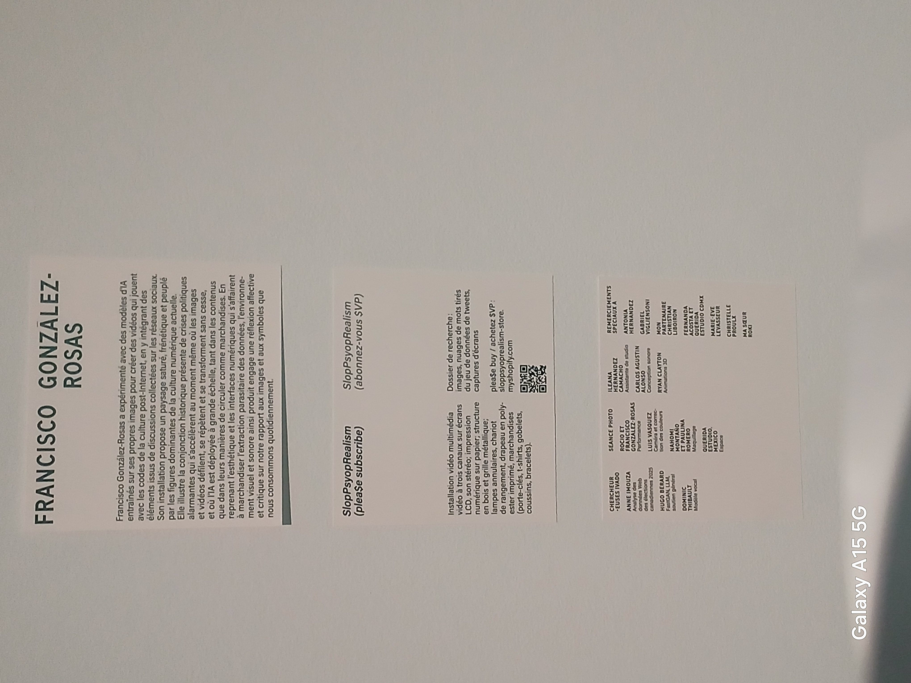
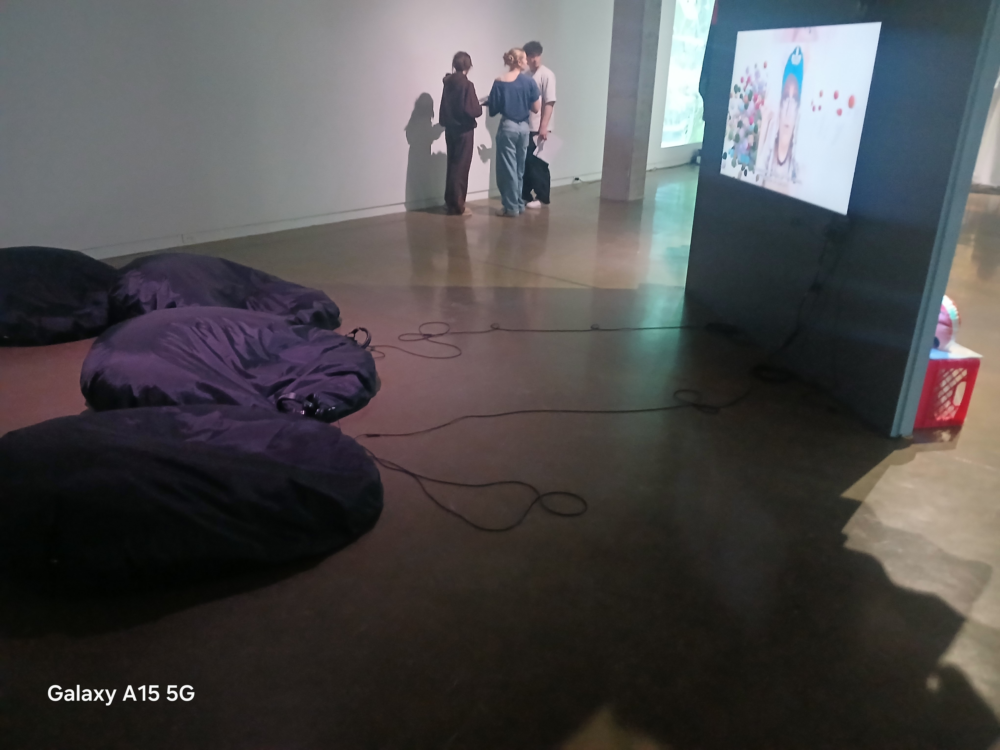
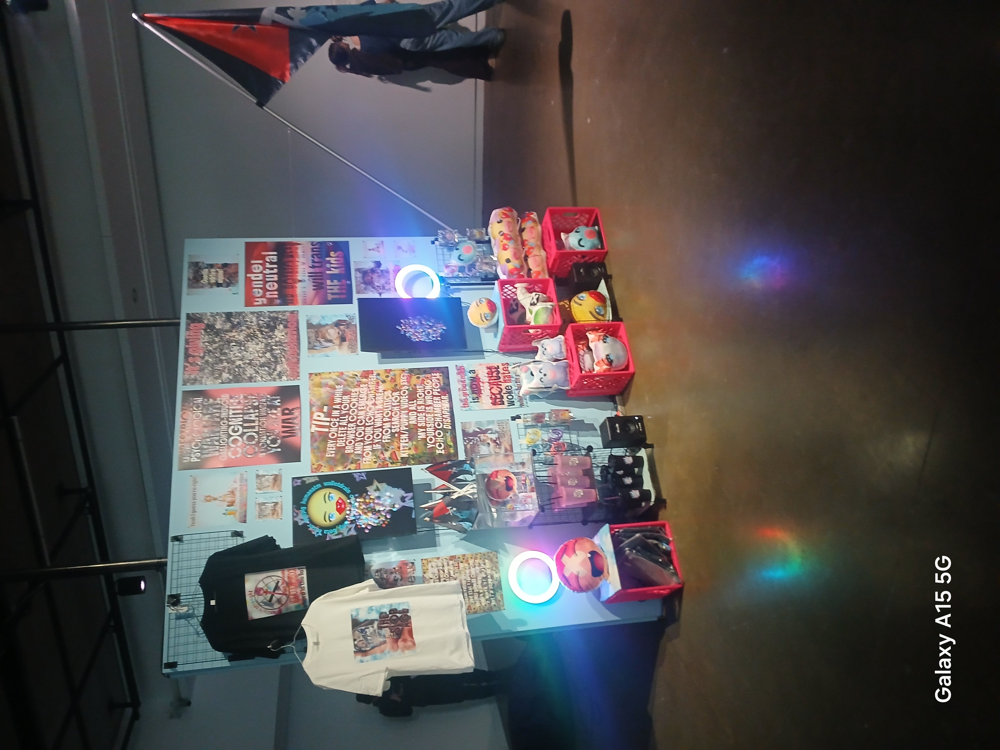
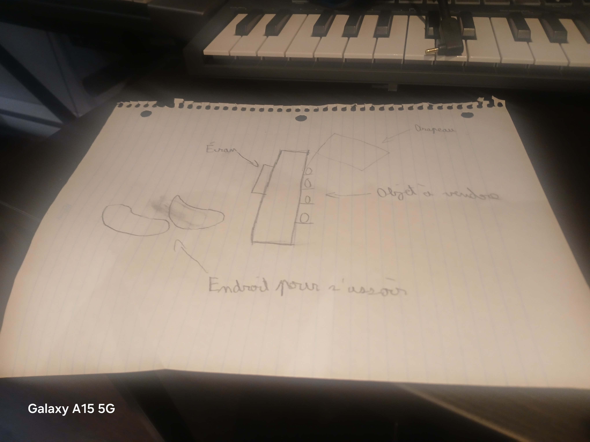
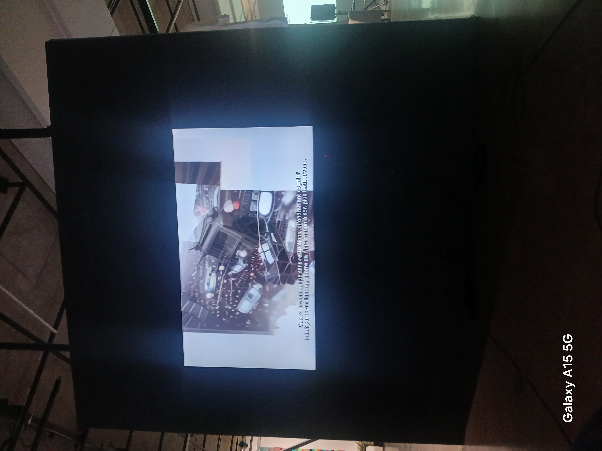
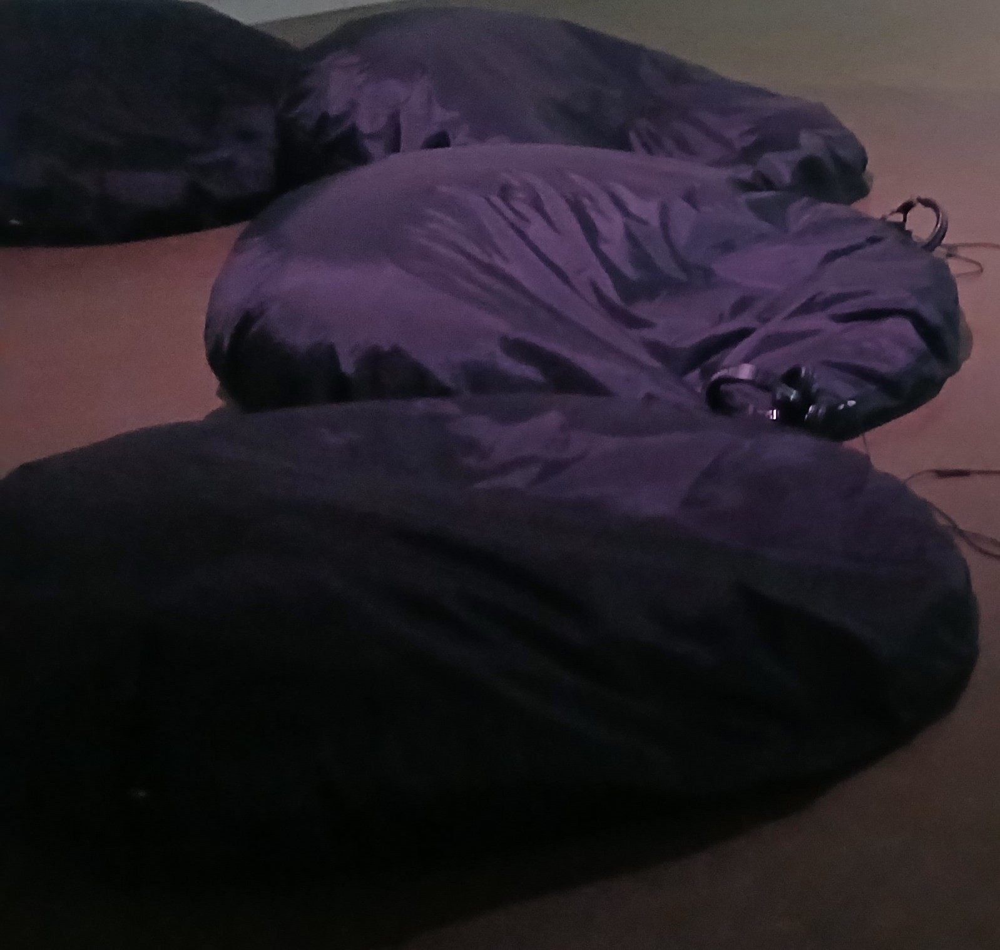
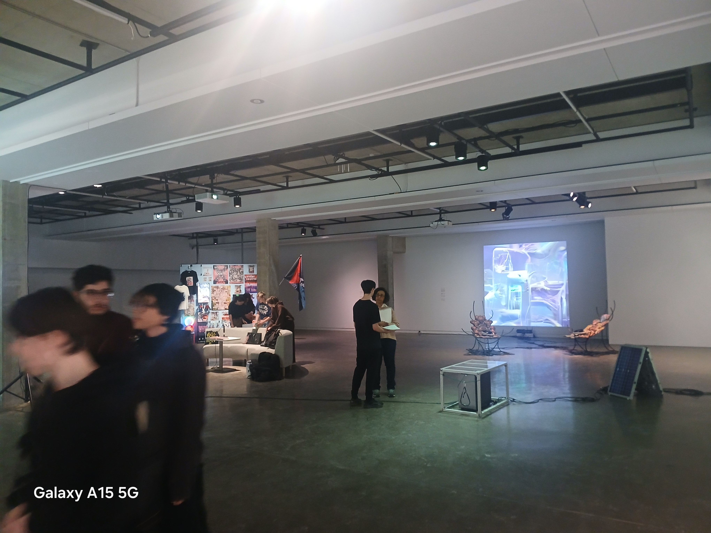

# Fiche d'exposition pour l'exposition de l'Université de Montréal
## Nom de l'exposition
Le nom de l'exposition est «Devenir partagé. Pratique de l'IA». Voici une affiche de l'exposition qui présente globalement l'exposition.

## Lieu de mise en exposition
Cette exposition a été présenté à la galerie de l'Université de Montréal. L'adresse de ce batiment est le 2940 chemin de la Côte-Sainte-Catherine. Voici l'entrée de l'exposition:

## Type d'exposition
Cette exposition est temporaire et intérieure. Cette exposition est disponible du 28 novembre 2025 au 28 février. Comme je l'ai dit précédemment l'exposition est à l'intérieur de la galerie de l'Université de Montréal.

## Date de visite
Je suis allé à l'exposition le 29 janvier 2026.

## Nom de l'oeuvre
Le nom de l'oeuvre que j'ai choisi est «SlopPsyopRealism (abonnez-vous $VP)». Voici une affiche qui décrit l'oeuvre dans son ensemble.

## Nom de l'artiste et Année de réalisation
L'artiste est Francisco González Rosas et son oeuvre a été faite en 2025.

## Description de l'oeuvre
L'oeuvre est séparée en deux parties. D'un côté il y a un petit kiosque où l'on peut acheter des souvenirs de l'oeuvre en question. De l'autre côté il y a un écran où il est diffusé une vidéo. C'est l'élément principal de l'oeuvre. La vidéo a été créée par l'intelligence artificielle. Elle a un côté très dérangeant comme les premières vidéos créées par l'IA. Les deux sections sont séparées par un mur où est accroché l'écran.

## Type d'installation
Cette oeuvre est contemplative. 

## Fonction du dispositif multimédia
La fonction du dispositif multimédia est la mise en contexte. En effet, on diffuse sur l'écran la vidéo que l'artiste Francisco González Rosas a faite.

## Mise en espace
Voici un croquis qui montrent comment sont placée les éléments.

## Composante technique
La composante technique principale est l'écran qui est accroché au mur.

## Élément nécessaire
Les poufs est un élément qui est important pour mieux profiter l'oeuvre.

## Expérience vécue
Nous sommes arrivés à la galerie et on s'est fait accueillir par une guide. Elle nous a montré toutes les oeuvres et dispositifs présents. Ensuite, on a pu visité la galerie par nous-même.

## Ce que j'ai aimé
J'ai aimé l'utilisation des poufs au lieu de chaises ou de bancs moins confortables. Même si on met à l'écart le fait que ce soit plus confortable, j'aime cette idée parce que puisque les poufs étaient confortables, tu as moins tendances à vouloir partir. 

## Ce que je n'ai pas aimé
Je n'ai pas aimé le magasin incrusté dans l'oeuvre. Je trouve qu'il n'apporte rien à l'oeuvre en tant que telle.
